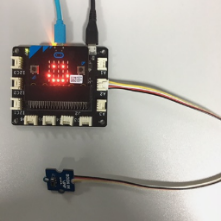
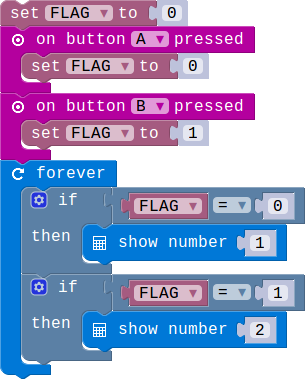
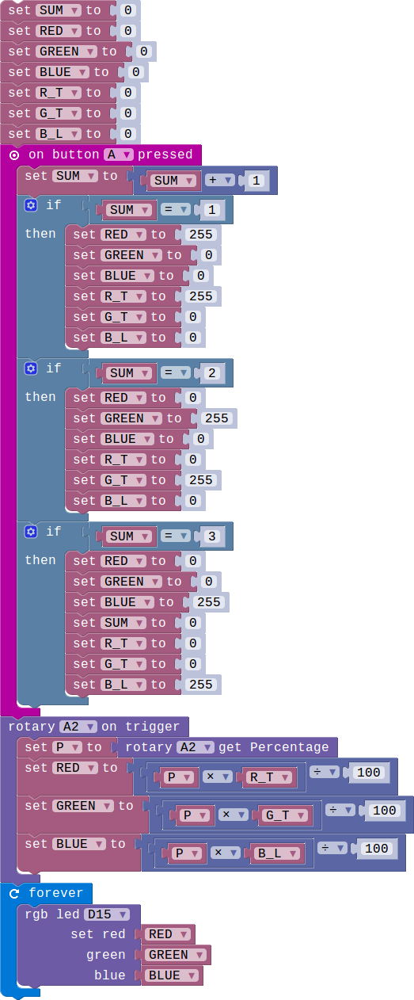
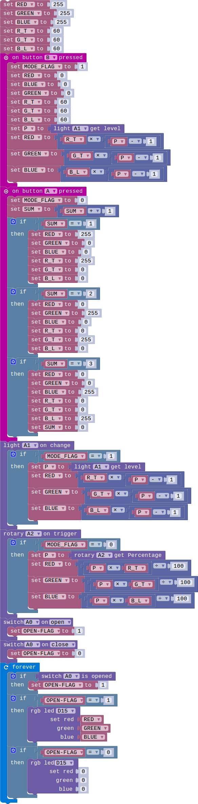

## Lesson 1.5 工程

- Duration: 10 minutes
- Difficulty: Beginner

### Introduction
As we 

### Materials
| Item |     Component           | Quantity |
|--------|---------------------------|-------------|
|    1   | Micro:bit                    |        1      |
|    2   | Connect Board          |        1      |
|    3   | Switch module          |        1      |
|    4   | RGB module              |        1      |
|    5   | Light Sensor module |        1      |
|    6   | Rotary module          |        1      |
|    7   | USB Micro-B Cable   |        2       |
|    8   | E-brick Cable             |        1      |

### Electronic Circuit
First we need to build the electroic circuit.

| Sensor Module ID | Connect Board Connector ID | Micro:bit Pin ID | Signal Type |
|------------------|----------------------------|------------------|-------------|
| Switch#1        | A0                         | pin0             | Analog IO  |
| Rotary#1        | A2                         | pin2            | Analog IO  |
| Light Sensor#1        | A1                         | pin1            | Analog IO  |
| RGB#1        | D15                         | pin15/pin16             | Digital IO  |

### Create Code

#### Step 1: 手动控制模式!

按下按键A进入模式1，按下按键B进入模式2.对应的模式的编号会在LED屏上显示.

#### Step 2: 手动模式控制灯颜色的切换和亮度的调节!

通过按键A选择不同的颜色，有红,绿和蓝色三种颜色可以选择。同时可以利用电位器调节RGB灯的亮度。

#### Step 3: 自动模式根据环境光照强度调整RGB的亮度!

RGB灯会根据周围的环境光照强度的等级调整RGB的亮度。当光照强度很高，也就是强度等级为1的时候，RGB会熄灭，当到达等级5，也就是最暗的时候RGB的亮度达到最高。亮度一共分为5级。

#### Step 4: 将两种模式结合起来!

以上是RGB台灯的完整代码。根据我们之前的设计，这个台灯分为两个模式，自动模式和手动模式。在自动模式下RGB灯的亮度由Light Sensor 控制，环境中亮度越高，RGB灯的亮度越低，相反，环境中的光照强度越低，RGB的亮度越高.在手动模式下，RGB的亮度由电位器控制。同时，RGB的亮灭由一个开关（Switch）控制，在两个模式下都可以正常控制。

### Interaction

> TODO:Add a gif/video/pic

### What next
> 1.通过按键控制RGB灯在RED,GREEN和BLUE之间切换。
> 2.使用Micro:bit上的两个按键，实现按下不同的按键RGB显示不同颜色。

### Reference
- [PIR](https://en.wikipedia.org/wiki/Passive_infrared_sensor)
