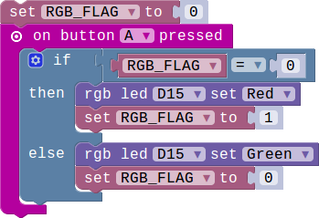

## Lesson 1.1 点亮你的RGB灯

- Duration: 10 minutes
- Difficulty: Beginner

### Introduction
本章会带你一起熟悉RGB模块的使用。主要是了解如何让它工作起来，并且可以让它显示各种颜色。

### Materials
| Item |     Component     | Quantity |
|------|-------------------|----------|
|    1 | Micro:bit         |        1 |
|    2 | Connect Board     |        1 |
|    3 | RGB LED module    |        1 |
|    4 | USB Micro-B Cable |        2 |
|    5 | E-brick Cable     |        1 |

### Electronic Circuit

First we need to build the electroic circuit.

| Sensor Module ID | Connect Board Connector ID | Micro:bit Pin ID | Signal Type |
|------------------|----------------------------|------------------|-------------|
| RGB-LED#1        | D15                         | pin15/pin16             | Digital IO  |

### Create Code

#### Step 1: Turn it on!

 

你可以从给定的选项中选择7种不同的颜色。

#### Step 2: 设置自定义颜色!

  
 
你可以自己设置RGB三种颜色的灰度值来组合出各种你喜欢的颜色。注意每个颜色的灰度值范围是从0到255.

#### Step 3: 自动切换颜色！

RGB灯每隔一秒钟切换一种颜色，在红绿蓝之间切换。

#### Step 4: 通过按键控制灯的颜色!

通过按键A控制RGB灯的颜色在红色和绿色之间来回切换。

### Interaction

> TODO:Add a gif/video/pic

### What next

> 1.通过按键控制RGB灯在RED,GREEN和BLUE之间切换。

> 2.使用Micro:bit上的两个按键，实现按下不同的按键RGB显示不同颜色。

### Reference

- [RGB color model](https://en.wikipedia.org/wiki/RGB_color_model)
