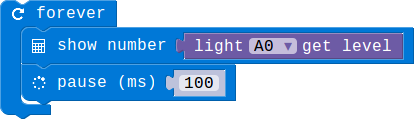
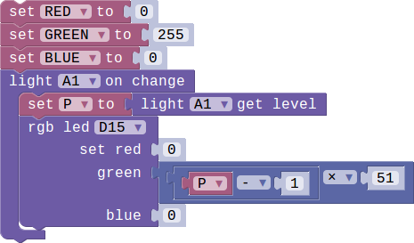

## Lesson 1.2 手动调节灯的亮度--Rotary的使用

- Duration: 10 minutes
- Difficulty: Beginner

### Introduction
RGB灯的亮度可以通过调节RGB三个灰度值的大小来设置。使用Light Sensor的时候请确认模块上的开关拨到了‘A’这边。

### Materials
| Item |     Component          | Quantity |
|------  |-------------------          |----------    |
|    1   | Micro:bit                   |        1      |
|    2   | Connect Board          |        1     |
|    3   | RGB LED module      |        1     |
|    3   | Light Sensor module  |        1      |
|    4   | USB Micro-B Cable   |        2     |
|    5   | E-brick Cable            |        1     |

### Electronic Circuit
First we need to build the electroic circuit.

| Sensor Module ID | Connect Board Connector ID | Micro:bit Pin ID | Signal Type |
|------------------|----------------------------|------------------|-------------|
| RGB-LED#1        | D15                         | pin15/pin16             | Digital IO  |
| Light Sensor#1        | A0                         | pin0             | Analog IO  |

### Create Code

#### Step 1: 获取当前的亮度等级!
 
获取当前的亮度等级。等级一个5级，1表示最亮，5表示最暗。

#### Step 2: RGB亮度自动根据环境光照强度变化！
 
每个环境亮度等级对应一个RGB的亮度。

### Interaction

> TODO:Add a gif/video/pic

### What next
> 改进之前的根据环境光照调整RGB亮度的程序，只使用一个设置亮度的模块。

### Reference
- [Potentiometer](https://en.wikipedia.org/wiki/Potentiometer)
