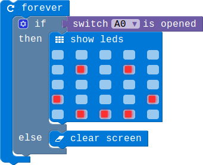

## Lesson 1.1 给你的台灯加个开关

- Duration: 10 minutes
- Difficulty: Beginner

### Introduction

这一节课我们学习Switch的使用。我们的台灯需要一个开关用来控制灯的开启和关闭，多以我们可以使用我们的Switch模块来实现这一功能。

### Materials

| Item |     Component     | Quantity |
|------|-------------------|----------|
|    1 | Micro:bit         |        1 |
|    2 | Connect Board     |        1 |
|    3 | Switch module    |        1 |
|    4 | USB Micro-B Cable |        2 |
|    5 | E-brick Cable     |        1 |

### Electronic Circuit

First we need to build the electroic circuit.

| Sensor Module ID | Connect Board Connector ID | Micro:bit Pin ID | Signal Type |
|------------------|----------------------------|------------------|-------------|
| Switch#1        | D15                         | pin15/pin16             | Digital IO  |

### Create Code

#### Step 1: 用开关控制是否显示!

你可以从给定的选项中选择7种不同的颜色。

#### Step 2: 用开关来控制灯的亮灭!

当开关打开的时候RGB灯显示一个颜色，当我们设置GREEN的值为255，也就是最大值的时候，其他的两个颜色为0的时候RGB灯会显示绿色。当检测到开关关闭的时候RGB三个值都为0，此时RGB灯关闭。

### Interaction

> TODO:Add a gif/video/pic

### What next

> 1.通过按键控制RGB灯在RED,GREEN和BLUE之间切换。

> 2.使用Micro:bit上的两个按键，实现按下不同的按键RGB显示不同颜色。

### Reference

