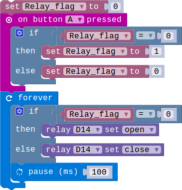
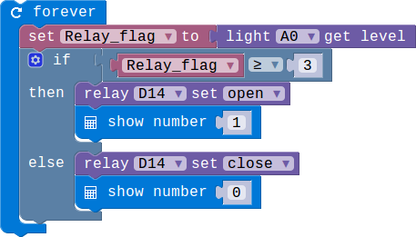

## Lesson 2.1 继电器的使用

- Duration: 10 minutes
- Difficulty: Beginner

### Introduction

A relay is an electrically operated switch.you can use it to control many things like the bulbs.

### Materials

| Item |     Component           | Quantity |
|--------|----------------------------|-------------|
|    1   | Micro:bit                    |        1      |
|    2   | Connect Board          |        1      |
|    3   | Relay module            |        1     |
|    3   | Light sensor module |        1     |
|    4   | USB Micro-B Cable   |        2     |
|    5   | E-brick Cable            |        1     |

### Electronic Circuit

First we need to build the electroic circuit.

| Sensor Module ID | Connect Board Connector ID | Micro:bit Pin ID | Signal Type |
|-----------------------|------------------------|----------------|---------------|
| Relay#1              | D14                       | pin14          | Digital IO  |
| Light Sensor#1   | A0                         | pin0            | Analog IO  |

### Create Code

#### Step 1: 利用按键控制继电器模块！

 
 
首先添加光线控制模块，当周围环境的光照强度变低的时候接通继电器，否则断开连接。

#### Step 2: 利用光线传感器控制继电器的通断！

 
 
当光照强度大于设置的等级（3级）的时候，继电器接通，否则继电器断开。接通时LED矩阵会显示1，断开时显示0.

### Interaction

> TODO:Add a gif/video/pic

### What next

> 设计一个程序，在光照强度等级为5的时候打开继电器，在光照强度等级小于3的时候断开继电器。

### Reference

- [Relay](https://en.wikipedia.org/wiki/Relay)
