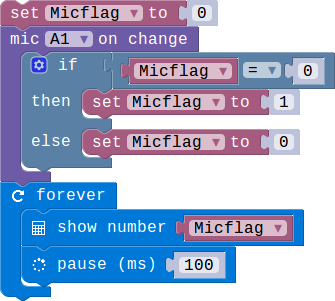
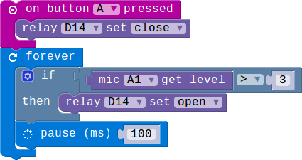

## Lesson 2.2 感应周围环境的噪音

- Duration: 10 minutes
- Difficulty: Beginner

### Introduction
MIC可以感知周围噪音的强度，当环境的噪音超过了阈值的时候会触发时间，同时我们将噪音分为了5级，1表示安静，5表示环境噪音最大。

### Materials
| Item |     Component          | Quantity |
|------  |-------------------          |----------    |
|    1   | Micro:bit                   |        1      |
|    2   | Connect Board          |        1     |
|    3   | MIC module              |        1     |
|    4   | Relay module           |        1     |
|    5   | USB Micro-B Cable   |        2     |
|    6   | E-brick Cable            |        1     |

### Electronic Circuit
First we need to build the electroic circuit.

| Sensor Module ID | Connect Board Connector ID | Micro:bit Pin ID | Signal Type |
|------------------|----------------------------|------------------|-------------|
| MIC#1        | A1                         | pin1             | Analog IO  |
| Relay#1     | D14                       | pin14           | Digital IO  |

### Create Code

#### Step 1: 检测声音发生变化!
 
当检测到周围的声音发生变化时LED矩阵显示不同的数据。

#### Step 2: 利用声音控制继电器！
 
当声音超过设置的阈值大于声音等级的时候继电器打开，通过按按键A关闭。

### Interaction

> TODO:Add a gif/video/pic

### What next
> 设计当声音超过在一定等级内的时候显示一个表情，在等级外的时候显示另一个表情。

### Reference
