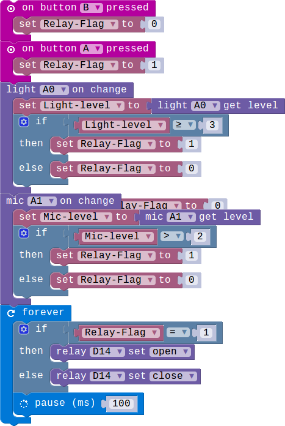

## Lesson 2.3 Smart Socket

- Duration: 10 minutes
- Difficulty: Beginner

### Introduction
介绍完我们要用到的模块，接下来我们开始完成我们的 Smart Socket。

### Materials
| Item |     Component          | Quantity |
|------  |-------------------          |----------    |
|    1   | Micro:bit                   |        1      |
|    2   | Connect Board          |        1     |
|    3   | MIC module              |        1     |
|    4   | Light  Sensor module |        1     |
|    5   | Relay module           |        1     |
|    6   | USB Micro-B Cable   |        2     |
|    7   | E-brick Cable            |        1     |

### Electronic Circuit
First we need to build the electroic circuit.

| Sensor Module ID | Connect Board Connector ID | Micro:bit Pin ID | Signal Type |
|------------------|----------------------------|------------------|-------------|
| MIC#1        | A1                         | pin1             | Analog IO  |
| Light Sensor#1        | A0                         | pin0             | Analog IO  |
| Relay#1     | D14                       | pin14           | Digital IO  |

### Create Code

#### Step 1: 检测声音发生变化!
 
当检测到周围的声音发生变化时LED矩阵显示不同的数据。

#### Step 2: 利用声音控制继电器！
 
当声音超过设置的阈值大于声音等级的时候继电器打开。

#### Step 3: 添加按键控制模块！
 
添加按键控制，按键A可以手动控制继电器接通，按键B用来控制继电器断开连接。

### Interaction

> TODO:Add a gif/video/pic

### What next
> 

### Reference
