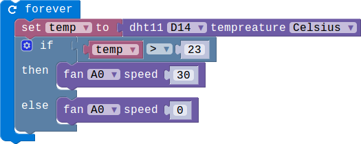

## Lesson 3.2 风扇的使用

- Duration: 10 minutes
- Difficulty: Beginner

### Introduction

这一节主要是了解Mini Fan的使用，风扇的控制主要是调节它的转速。

### Materials

| Item |     Component          | Quantity |
|------  |-------------------          |----------   |
|    1   | Micro:bit                   |        1      |
|    2   | Connect Board          |        1     |
|    3   | DHT11 module         |        1     |
|    4   | Mini Fan module       |        1     |
|    5   | USB Micro-B Cable   |        2     |
|    6   | E-brick Cable            |        1     |

### Electronic Circuit

First we need to build the electroic circuit.

| Sensor Module ID | Connect Board Connector ID | Micro:bit Pin ID | Signal Type |
|------------------|----------------------------|------------------|-------------|
| DHT11#1        | D14                         | pin14             | Digital IO  |
| Mini Fan#1     | A0                           | pin0             | Analog IO  |

### Create Code

#### Step 1: 打开风扇！

 
 
通过设置该值确定风扇的转速，转速范围从0到100.0的时候电机停止转动，100的时候电机的速度达到最快。

> ** 电机快速转动的时候要注意安全，不要将手指伸向扇叶，以免受伤！**

#### Step 2: 利用温度控制风扇！

 
 
当检测到温度高于23摄氏度的时候风扇开始转动，低于23摄氏度的时候风扇关闭。

### Interaction

> TODO:Add a gif/video/pic

### What next

> 给风扇添加按键控制，按键A控制风扇加速，按键B控制风扇减速。

### Reference

- [DC motor](https://en.wikipedia.org/wiki/DC_motor)