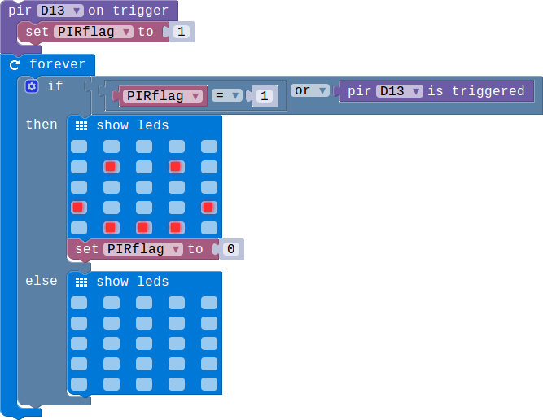

## Lesson 3.3 检测移动的物体

- Duration: 10 minutes
- Difficulty: Beginner

### Introduction
PIR 模块用来检测移动的物体.

### Materials
| Item |     Component          | Quantity |
|------  |-------------------          |----------   |
|    1   | Micro:bit                   |        1      |
|    2   | Connect Board          |        1     |
|    3   | PIR module               |        1     |
|    4   | USB Micro-B Cable   |        2     |
|    5   | E-brick Cable            |        1     |

### Electronic Circuit
First we need to build the electroic circuit.

| Sensor Module ID | Connect Board Connector ID | Micro:bit Pin ID | Signal Type |
|------------------|----------------------------|------------------|-------------|
| PIR#1        | D13                         | pin13             | Digital IO  |

### Create Code

#### Step 1: 检测物体的移动！
 
当检测到移动的物体的时候，LED矩阵会显示一个笑脸的图案。

### Interaction

> TODO:Add a gif/video/pic

### What next
> 通过按键控制是否开启PIR的物体检测功能，当按下按键A的时候PIR开始工作，按下按键B的时候忽略PIR的信号。

### Reference
- [Passive infrared sensor](https://en.wikipedia.org/wiki/Passive_infrared_sensor#MOTION)