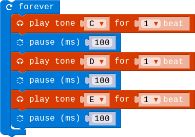

## Lesson 3.4 扬声器的使用

- Duration: 10 minutes
- Difficulty: Beginner

### Introduction
这一节我们学习扬声器的使用，Micro:Bit的库中有Music相关的Block供我们使用，我们可以利用它提供的Block让我们的Speaker模块发出多种自定义的声音。

### Materials
| Item |     Component          | Quantity |
|------  |-------------------          |----------   |
|    1   | Micro:bit                   |        1      |
|    2   | Connect Board          |        1     |
|    3   | Speaker module        |        1     |
|    4   | USB Micro-B Cable   |        2     |
|    5   | E-brick Cable            |        1     |

### Electronic Circuit
First we need to build the electroic circuit.

| Sensor Module ID | Connect Board Connector ID | Micro:bit Pin ID | Signal Type |
|------------------|----------------------------|------------------|-------------|
| Speaker#1        | A0                         | pin0             | Analog IO  |

### Create Code

#### Step 1: 让你的Speaker发出声音来！

 
 
这样我们就可以听到三个节拍的声音在循环播放。

### Interaction

> TODO:Add a gif/video/pic

### What next

> 让你的Speaker唱一首简单的歌！

### Reference

- [Speaker](https://en.wikipedia.org/wiki/Full-range_speaker)