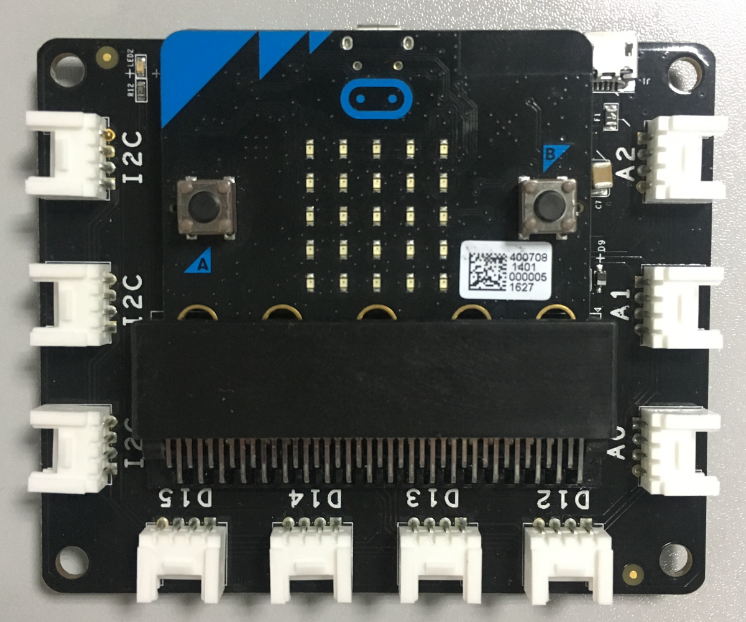
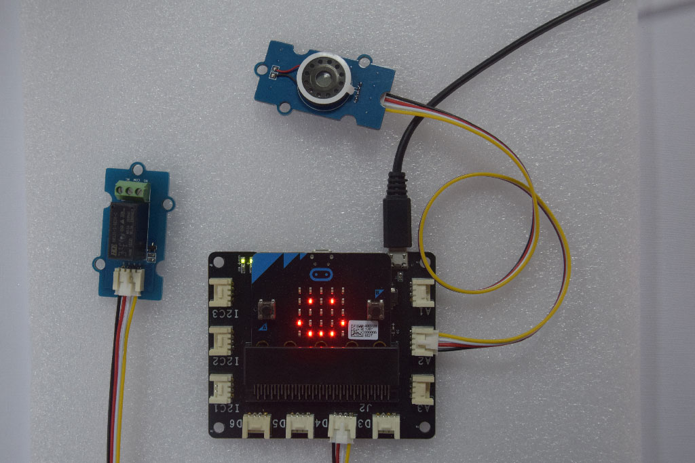

# Lesson 01 - Meet the Mi:Node Kit

The Mi:Node kit is a modular, safe and easy to use group of items that allow kids to minimize the effort required to get started with IOT learning with Micro:bit.

For this kit, there is no need for soldering, plug then use, the construction of the working circuit can be done within one minute.

- It is modular, safe and ready-to-use just like Lego
- 10 sensor modules include environmental monitoring, user interface and physical monitoring can be built a lot of cool projects include wearable device and smart home, etc.
- It is expandable and reusable
- Rich education guide document and many project stories

## What is the Kit?

### What is it include?

#### Plan A - IOT Advanced Kit

| Category           | Module                          | Quantity | Conector Type     | Description                              |
| ------------------ | ------------------------------- | -------- | ----------------- | ---------------------------------------- |
| Micro:bit          | Micro:bit Main Board            | 0        | NA                | The Micro:bit is not include in the kit  |
| Connect Board      | Connect Board                   | 1        | NA                | This a bridge between the micro:bit and sensor modules |
| Sensor Module (10) | Light Sensor                    | 1        | Analog Input      | It can be used to detect the intensity of light in the environment |
|                    | Temperature and Humidity Sensor | 1        | Analog Input      | It can get temperature and humidity in the environment |
|                    | Sound Sensor                    | 1        | Analog Input      | It can detect the sound strength of the environment |
|                    | Rotary Angle                    | 1        | Analog Input      | It can produce analog output between 0 and Vcc by adjust the angular range from 0 ~ 300. |
|                    | Mini Fan                        | 1        | Analog Output/PWM | A DC motor + orbit fan                   |
|                    | Speaker                         | 1        | Analog Output/PWM | Voice output speaker                     |
|                    | PIR Motion Sensor               | 1        | Digital Input     | It allows user to sense motion, usually human movement in its range |
|                    | RGB LED                         | 1        | Digital Output    | A colorful LED. The color and brightness can be programable |
|                    | Switch                          | 1        | Digital Input     | It can used to switch ON/OFF             |
|                    | Relay                           | 1        | Digital Output    | It is an digital switch can be used to control high-votage elecrical devices. (maximum 250V) |
| Cables             | Universal 4 Pin Buckled Cable   | 8        | NA                | 20cm cable x 2, 10cm cable x 6           |
|                    | Micro-B USB cable               | 2        | NA                | 1 for power input, 1 for micro:bit program upload |

### How it works

The kit is composed of a connect board and several sensor modules. The connect board is a bridge between the micro:bit main board and the sensor modules. It converts the micro:bit edge connector into serveral E-brick connector. The sensor modules can be attached to it by cable.

#### E-brick Connector

The E-brick connectors are compatible with the standard Grove from Seeed. It's a 2.0mm 1x4 connector. With signals include: 1 VCC, 1GND, 2 analog / digital signal.

An E-brick connector have 4 pins:

| Pin ID | Pin  Name | Description                              |
| ------ | --------- | ---------------------------------------- |
| Pin#1  | Signal#1  | Connect to a micro:bit pin with analog in / digital io / i2c function |
| Pin#2  | Signal#2  | Same to Signal#1. The Signal#2 is often not used, because 1 signal pin is enough for most sensor modules |
| Pin#3  | VCC       | Power pin                                |
| Pin#4  | GND       | Power pin                                |

There are 3 types of the connector:
- 3 analog input connectors
- 3 I2C connectors
- 4 digital IO connectors

##### E-brick Connector - Analog In Type

| Pin ID | Pin Name | Remark                                   |
| ------ | -------- | ---------------------------------------- |
| Pin#1  | A1       | Connect to a micro:bit pin with analog input function |
| Pin#2  | A2       | Same to A1, but most sensor module may not use the A2 pin |

##### E-brick Connector - Digital IO Type

| Pin ID | Pin Name | Remark                                   |
| ------ | -------- | ---------------------------------------- |
| Pin#1  | D1       | Connect to a micro:bit pin with digital io function |
| Pin#2  | D2       | Same to D1, but most sensor module may not use the D2 pin |

##### E-brick Connector - IIC Type

[IIC (Inter-Integrated Circuit)](https://en.wikipedia.org/wiki/I%C2%B2C), pronounced I-squared-C, is a multi-master, multi-slave, single-ended, serial computer bus invented by Philips Semiconductor (now NXP Semiconductors). It is typically used for attaching lower-speed peripheral to microcontrollers in short-distance, intra-board communication.

There are some sensor modules based on the IIC bus. We can attach serveral modules on the same bus, Because they can be identificated by different addresses.

| Pin ID | Pin Name | Remark                                   |
| ------ | -------- | ---------------------------------------- |
| Pin#1  | IIC SCL  | IIC clock signal. Connect to micro:bit pin19 |
| Pin#2  | IIC  SDA | IIC data signal. Connect to micro:bit pin20 |

#### Conversation on Remaping Micro:bit Edge Pin

Please note the Connector Name. There is a convention in the connector name. A connector name can be indicated the mapped micro:bit signal name.

For example: Connector D12 means: The Signal#1 is remapped to micro:bit pin 12, and Signal#2 is remapped to micro:bit pin 13(12+1)

It's useful for us to position the micro:bit pin quickly when develop code.

| Connector Type | Connector Name | Micro:bit Pin Name(Signal#1, Signal#2) |
| -------------- | -------------- | -------------------------------------- |
| Analog Input / | A0             | pin0, pin1                             |
| Digital IO     | A1             | pin1, pin2                             |
|                | A2             | pin2, pin3                             |
| Digital IO     | D12            | pin12, pin13                           |
|                | D13            | pin13, pin14                           |
|                | D14            | pin14, pin15                           |
|                | D15            | pin15, pin16                           |
| IIC            | IIC0           | pin19, pin20                           |
|                | IIC1           | pin19, pin20                           |
|                | IIC2           | pin19, pin20                           |

- We usually use A0, A1, A2 as a analog input connector, but it can also be used as a digital io connector.
- D12, D13, D14, D15 can be only used as digital io connector.
- IIC0, IIC1, IIC2 can be only used as IIC connector.

### How to use it

Just plug then use it, That's easy.

> Note: We should indicate the connector type when we use a sensor module. Then connect it the corresponding connector on the connect board.

## Programming with the kit

As you know, There are 4 editors we can chose on micro:bit official website.
- Code Kingdoms JavaScript
- Microsoft Block Editor
- Microsoft Touch Develop
- python

We'll focus more on the [Microsoft PXT](https://pxt.microbit.org). 

### Work with our library

We'll develop the libraries for the sensor modules. This can reduce your effort on using the modules.You don't have to study the technical details of the modules. For example, The RGB LED is based on the IIC bus, We just need to call the library function to control the color and brightness. We don't care the IIC bus itself.

With the library, you don't need to care which pin a module connects to, You just need to know what E-brick connector is used.

> Note: The library is based on Microsoft PXT.

#### Steps

Step 1: Add our library to your code

Step 2: Refer to the API reference or example code

Step 3: Call the library function.

### Work without our library

You can also use the micro:bit pin library to control the sensor modules directly. In this situation, We can get the micro:bit pin ID by the E-brick connector ID. For example, We connect a sensor module to `D12`. Then We can get that the corresponding Micro:bit pin is `pin12`.

## Getting start with the courses

We provide courses to help you getting started with the kit quickly.

The courses have 3 parts:

| Item | Subject                | Description                              |
| ---- | ---------------------- | ---------------------------------------- |
| 1    | Intro & Quick Start    | This Lesson and a quick start            |
| 2    | Do it yourself         | 3 DIY Project divided into 10 lessons    |
| 3    | Reference/Manual Guide | 1 module 1 guide. Such as Spec, Example Code, Library Reference and etc. |

Now we provide 3 DIY projects:
- Make an Automatic Desktop Lamp
- Make a Smart Pet Robot
- Make Your Home Appliance Smart

These 3 projects will cover these 10 sensor modules. In each lessons, We'll show you have to use the sensor modules and guide you to make your own "things".

We also consider to add some new DIY projects about talking to the smart phone / raspberry pi / IOT cloud in the future. Will update on our website.

## Share your code to the community

You are welcomed to share your code / project to the community. Let's continue our journey learning IOT together.

- [Twitter]()
- [Facebook]()
- [Forum]()

## Useful Reference

- [A quick start lesson]()
- [Reference Guide]()
- [Micro:Bit Edge Pin Map]()
- [Our shared libraries and code page on microbit.co.uk]()
- [Microsoft Touch Develop Lessons](https://www.microbit.co.uk/td/lessons)

