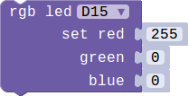
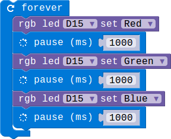

# Lesson 03-01 Let's turn on the RGB LED

- Duration: 10 minutes
- Difficulty: Beginner

## Introduction

This lesson will teach you how to control the RGB LED. Then you can turn on/off the led and switch a differenct color you like.

### Materials
| Item | Component         | Quantity |
| ---- | ----------------- | -------- |
| 1    | Micro:bit         | 1        |
| 2    | Connect Board     | 1        |
| 3    | RGB LED module    | 1        |
| 4    | USB Micro-B Cable | 2        |
| 5    | E-brick Cable     | 1        |

### Electronic Circuit

First we need to build the electroic circuit.

| Sensor Module ID | Connect Board Connector ID | Micro:bit Pin ID | Signal Type |
| ---------------- | -------------------------- | ---------------- | ----------- |
| RGB-LED#1        | D15                        | pin15/pin16      | Digital IO  |

### Create Code

#### Step 1: Turn it on!

 

 You can choose your favorite color for the 7 differenct colors.

#### Step 2: Don't like the 7 colors, Let's DIY favorite colors ourself

  

Assignment different value the parameters red / green / blue. Different values make different colors.

> **NOTE**
>
> The values of red/green / blue should be between 0 to 255.

#### Step 3:  Blinky the LED with different colors

The LED will change colors per second. Loop from red to blue.

#### Step 4: Add a button to control the color

The color will be changed by press the button A between red and green.

### Interaction

> **TODO**
>
> [Software Team] Add a vedio

### What next

1. Let the button A to control the color. The color will be changed by press it between the three colors: red, green and blue.
2. Let's use both button A and B. Press different button showing different color.

### Reference

- [RGB color model](https://en.wikipedia.org/wiki/RGB_color_model)
