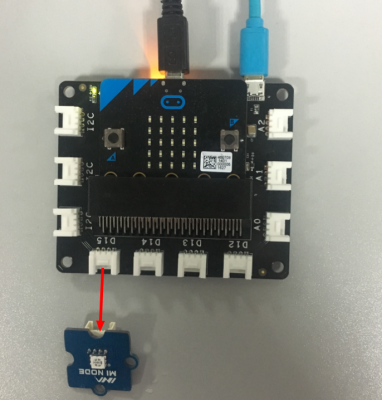
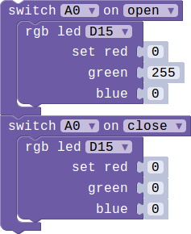

## Lesson 03-04 Add a switch to the lamp

- Duration: 10 minutes
- Difficulty: Beginner

### Introduction

This lesson we'll learn how to use the Switch module. We'll use the Switch module to turn on/off the lamp.

### Materials

| Item | Component         | Quantity |
| ---- | ----------------- | -------- |
| 1    | Micro:bit         | 1        |
| 2    | Connect Board     | 1        |
| 3    | Switch module     | 1        |
| 4    | USB Micro-B Cable | 2        |
| 5    | E-brick Cable     | 1        |

### Electronic Circuit

First we need to build the electroic circuit.

> **TODO**
>
> [Software Team] Insert the electronic picture

| Sensor Module ID | Connect Board Connector ID | Micro:bit Pin ID | Signal Type |
| ---------------- | -------------------------- | ---------------- | ----------- |
| Switch#1         | D15                        | pin15/pin16      | Digital IO  |

### Create Code

#### Step 1: Display a :) when switch on

#### Step 2: Use the Switch to turn ON/OFF the LED

### Interaction

> **TODO**
>
> [Software Team] Add a vedio

### What next

> **TODO**
>
> [Software Team] Add exercises

### Reference

