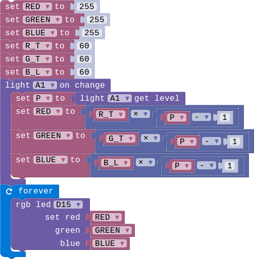

## Lesson 03-05 Add code and finish the project

- Duration: 10 minutes
- Difficulty: Beginner

### Introduction

We have learned how to use the modules. And now let's implement the smart lamps functions.

### Materials
| Item | Component           | Quantity |
| ---- | ------------------- | -------- |
| 1    | Micro:bit           | 1        |
| 2    | Connect Board       | 1        |
| 3    | Switch module       | 1        |
| 4    | RGB module          | 1        |
| 5    | Light Sensor module | 1        |
| 6    | Rotary module       | 1        |
| 7    | USB Micro-B Cable   | 2        |
| 8    | E-brick Cable       | 1        |

### Electronic Circuit

First we need to build the electroic circuit.

> **TODO**
>
> [Software Team] Insert the electronic picture

| Sensor Module ID | Connect Board Connector ID | Micro:bit Pin ID | Signal Type |
| ---------------- | -------------------------- | ---------------- | ----------- |
| Switch#1         | A0                         | pin0             | Analog IO   |
| Rotary#1         | A2                         | pin2             | Analog IO   |
| Light Sensor#1   | A1                         | pin1             | Analog IO   |
| RGB#1            | D15                        | pin15/pin16      | Digital IO  |

### Create Code

#### Step 1: Switch between manual mode and auto mode

#### Step 2: Implement the manual mode

#### Step 3: Auto Mode

#### Step 4: Integrate the two modes

### Interaction

> **TODO**
>
> [Software Team] Add a vedio

