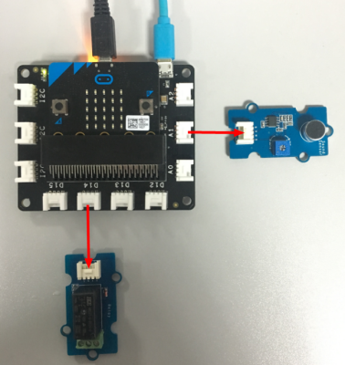
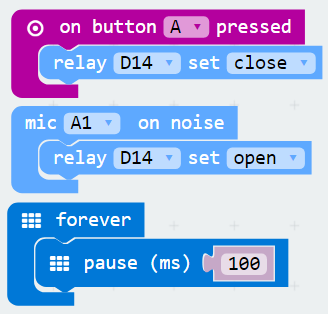

## Lesson 04-02 Sound control the relay

- Duration: 10 minutes
- Difficulty: Beginner

### Introduction

The MIC/Sound sensor can sensor the ambient noise. In this lesson when the noise is detected the Relay module will open and we can close the relay by pressing button A.

### Materials

| Item | Component         | Quantity |
| ---- | ----------------- | -------- |
| 1    | Micro:bit         | 1        |
| 2    | Connect Board     | 1        |
| 3    | MIC module        | 1        |
| 4    | Relay module      | 1        |
| 5    | USB Micro-B Cable | 2        |
| 6    | E-brick Cable     | 1        |

### Electronic Circuit

First we need to build the electroic circuit.

| Sensor Module ID | Connect Board Connector ID | Micro:bit Pin ID | Signal Type |
| ---------------- | -------------------------- | ---------------- | ----------- |
| MIC#1            | A1                         | pin1             | Analog IO   |
| Relay#1          | D14                        | pin14            | Digital IO  |

### Create Code

#### Step 1:  Ambient noise control the Relay

 

### Interaction

> **TODO**
>
> [Software Team] Add a vedio

### What next

1. Implement a program: Open the relay and hold the status for 3 seconds. Close the relay after 3 seconds.

### Reference
