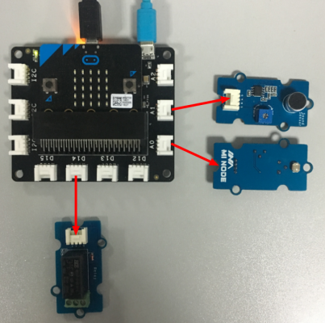
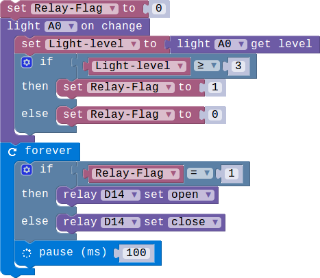
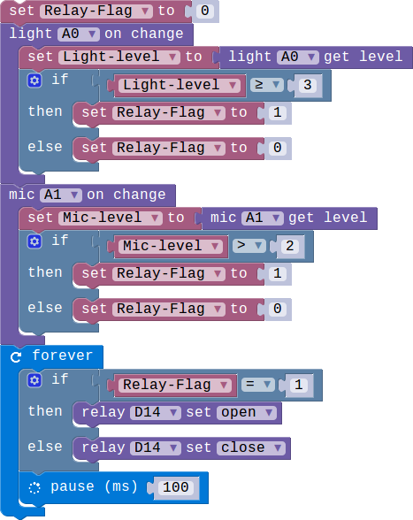

## Lesson 04-03 Add code and finish the project

- Duration: 10 minutes
- Difficulty: Beginner

### Introduction

We have learned how to use the modules. And now let's implement the smart socket.

### Materials
| Item | Component            | Quantity |
| ---- | -------------------- | -------- |
| 1    | Micro:bit            | 1        |
| 2    | Connect Board        | 1        |
| 3    | MIC module           | 1        |
| 4    | Light  Sensor module | 1        |
| 5    | Relay module         | 1        |
| 6    | USB Micro-B Cable    | 2        |
| 7    | E-brick Cable        | 1        |

### Electronic Circuit

First we need to build the electroic circuit.

| Sensor Module ID | Connect Board Connector ID | Micro:bit Pin ID | Signal Type |
| ---------------- | -------------------------- | ---------------- | ----------- |
| MIC#1            | A1                         | pin1             | Analog IO   |
| Light Sensor#1   | A0                         | pin0             | Analog IO   |
| Relay#1          | D14                        | pin14            | Digital IO  |

### Create Code

#### Step 1: Optical control Relay

 

#### Step 2: Sound control Relay

 

#### Step 3: Add buttons to control the Relay

 

### Interaction

> **TODO**
>
> [Software Team] Add a vedio

