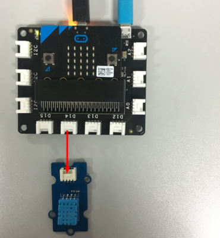
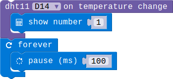

## Lesson 05-01 Sensor the ambient temperature

- Duration: 10 minutes
- Difficulty: Beginner

### Introduction

In this lesson, We'll learn how to use the DHT11 module. It can be used to sensor the temperature and humidity.

### Materials

| Item | Component         | Quantity |
| ---- | ----------------- | -------- |
| 1    | Micro:bit         | 1        |
| 2    | Connect Board     | 1        |
| 3    | DHT11 module      | 1        |
| 4    | USB Micro-B Cable | 2        |
| 5    | E-brick Cable     | 1        |

### Electronic Circuit

First we need to build the electroic circuit.

| Sensor Module ID | Connect Board Connector ID | Micro:bit Pin ID | Signal Type |
| ---------------- | -------------------------- | ---------------- | ----------- |
| DHT11#1          | D14                        | pin14            | Digital IO  |

### Create Code

#### Step 1: Sensor the temperature when pressing a button

 

#### Step 2: Monitor the temperature changing

 

### Interaction

> **TODO**
>
> [Software Team] Add a vedio

### What next

1. Get the temperature in fahrenheit

### Reference