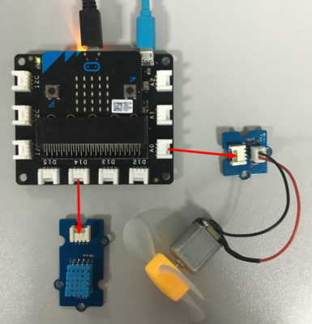

## Lesson 05-02 Turn on the Fan

- Duration: 10 minutes
- Difficulty: Beginner

### Introduction

This lesson will teach you have to use the Mini Fan. 

### Materials

| Item | Component         | Quantity |
| ---- | ----------------- | -------- |
| 1    | Micro:bit         | 1        |
| 2    | Connect Board     | 1        |
| 3    | DHT11 module      | 1        |
| 4    | Mini Fan module   | 1        |
| 5    | USB Micro-B Cable | 2        |
| 6    | E-brick Cable     | 1        |

### Electronic Circuit

First we need to build the electroic circuit.

| Sensor Module ID | Connect Board Connector ID | Micro:bit Pin ID | Signal Type |
| ---------------- | -------------------------- | ---------------- | ----------- |
| DHT11#1          | D14                        | pin14            | Digital IO  |
| Mini Fan#1       | A0                         | pin0             | Analog IO   |

### Create Code

#### Step 1: Turn on the Fan

 

You can set the speed value between 0 to 100. It'll be off when speed value is 0 and fastest when 100.

> **Danger**
>
> Please don't let the fan hurt you.

#### Step 2: The temperature control the fan on/off

 

### Interaction

> **TODO**
>
> [Software Team] Add a vedio

### What next

1. Implement below program: Turn up the fan speed when press button A and turn down the fan speed when press button B

### Reference

- [DC motor](https://en.wikipedia.org/wiki/DC_motor)