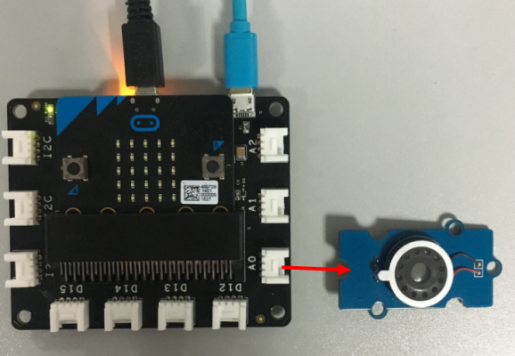

## Lesson 05-04 Make some sounds

- Duration: 10 minutes
- Difficulty: Beginner

### Introduction

In this lesson we'll learn how to make some sounds using the Speaker module.

### Materials
| Item | Component         | Quantity |
| ---- | ----------------- | -------- |
| 1    | Micro:bit         | 1        |
| 2    | Connect Board     | 1        |
| 3    | Speaker module    | 1        |
| 4    | USB Micro-B Cable | 2        |
| 5    | E-brick Cable     | 1        |

### Electronic Circuit
First we need to build the electroic circuit.

| Sensor Module ID | Connect Board Connector ID | Micro:bit Pin ID | Signal Type |
| ---------------- | -------------------------- | ---------------- | ----------- |
| Speaker#1        | A0                         | pin0             | Analog IO   |

### Create Code

#### Step 1: Make some noise

 

### Interaction

> **TODO**
>
> [Software Team] Add a vedio

### What next

1. Let's make some music.

### Reference

- [Speaker](https://en.wikipedia.org/wiki/Full-range_speaker)