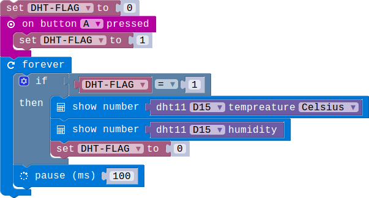
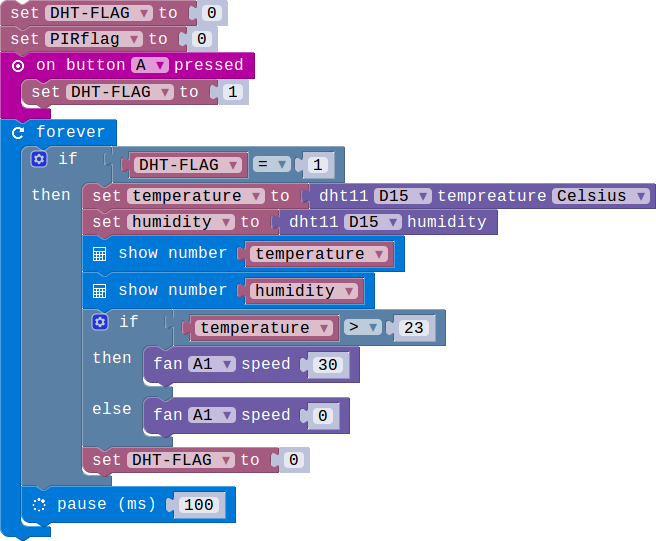
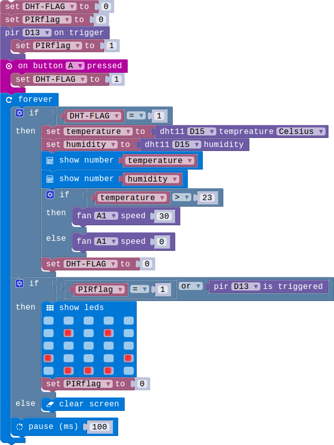
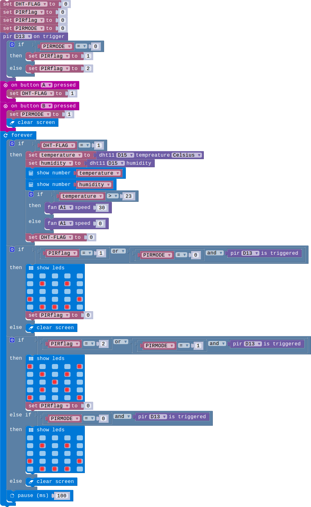
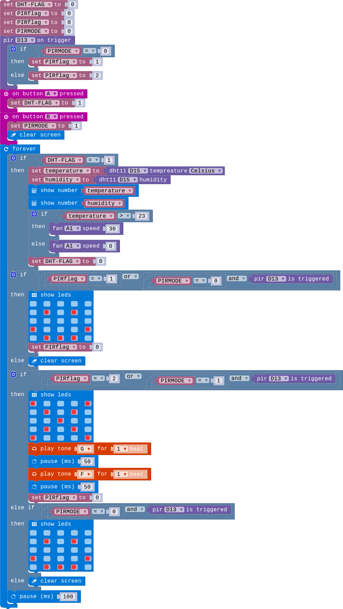

## Lesson 05-05 Add code and finish the project

- Duration: 10 minutes
- Difficulty: Beginner

### Introduction

We have learned how to use the modules. And now let's implement the robot.

### Materials
| Item | Component         | Quantity |
| ---- | ----------------- | -------- |
| 1    | Micro:bit         | 1        |
| 2    | Connect Board     | 1        |
| 3    | Speaker module    | 1        |
| 4    | DHT11 module      | 1        |
| 5    | PIR module        | 1        |
| 6    | Mini Fan module   | 1        |
| 7    | USB Micro-B Cable | 2        |
| 8    | E-brick Cable     | 1        |

### Electronic Circuit

First we need to build the electroic circuit.

> **TODO**
>
> [Software Team] Insert the electronic picture

| Sensor Module ID | Connect Board Connector ID | Micro:bit Pin ID | Signal Type |
| ---------------- | -------------------------- | ---------------- | ----------- |
| Speaker#1        | A0                         | pin0             | Analog IO   |
| Mini Fan#1       | A1                         | pin1             | Analog IO   |
| PIR#1            | D13                        | pin13            | Digital IO  |
| DHT11#1          | D15                        | pin15            | Digital IO  |

### Create Code

#### Step 1: Sensor the temperature by pressing a button

 

#### Step 2: Let the temperature contorl the fan on/off

 。

#### Step 3: Add the PIR

 

#### Step 4: Implement the security alarm mode

 

#### Step 5: Use the Speark module to alarm

 

### Interaction

> **TODO**
>
> [Software Team] Add a vedio
